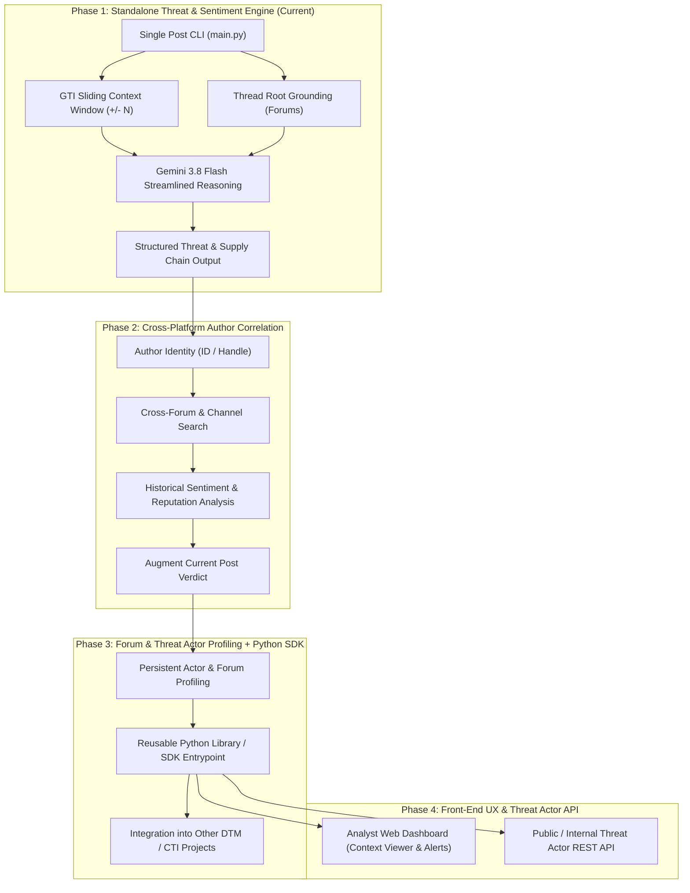

# 📄 Product Requirements Document (PRD)
## Contextual Underground Threat & Sentiment Intelligence System (CUTSIS)

**Author:** Google Threat Intelligence (GTI) Pair-Programming Team  
**Status:** Active Draft / Phase 1 Architecture  
**Target Platform:** Google Threat Intelligence (GTI) DDW API + Google Generative AI (Gemini 3.8 Flash) + Google Cloud (BigQuery)  

---

## 1. Executive Summary & Problem Statement

### 1.1 Problem Statement
In underground cybercrime forums and encrypted messenger channels (e.g., Telegram, Discord, darknet boards), isolated communications often trigger false positives or conceal true operational risk:
* **The "Isolated Post" Fallacy:** An initial access broker (IAB) claiming *"Selling administrative VPN access to Global Logistics Firm X for $5,000"* may be an active compromise, a recycled credential dump, or an outright scam. Automated keyword scrapers lack the context to distinguish genuine breaches from fraudulent chatter.
* **The Peer Signal Gap:** In underground communities, the real validation signal exists in the **immediate conversation surrounding the post**. Short messages such as `"vouch"`, `"escrow?"`, `"dm'ed"`, `"fake proof"`, or `"ripper (scammer)"` provide definitive evidence of transaction progression and community consensus.
* **The Longitudinal Actor Blindspot:** Without correlating an actor's handle across multiple underground channels over time, security teams cannot evaluate whether an author is a reputable specialist broker, a serial spam bot, or an emerging threat actor pivoting toward high-value corporate targets.

### 1.2 System Vision
The **Contextual Underground Threat & Sentiment Intelligence System (CUTSIS)** transforms unstructured dark web chatter into validated, actionable cyber threat intelligence. By pairing direct GTI DDW sliding context windows ($\pm N$ messages) and cross-channel actor profiling with Gemini LLM reasoning, CUTSIS automatically determines:
1. **Threat Legitimacy & Severity:** Is the post credible, actionable, and verified?
2. **Actor Profile & Reliability:** Standardized CTI Admiralty Scale (`A1`–`F6`) rating and behavioral archetype classification.
3. **Target & Supply Chain Risk:** Specific corporate entities, technology stacks, and industrial sectors placed at risk.

---

## 2. Target Personas & Use Cases

| Persona | Primary Needs | How CUTSIS Solves It |
| :--- | :--- | :--- |
| **Cyber Threat Intelligence (CTI) Analyst** | Rapid triage of dark web mentions and threat actor dossiers. | Automates context gathering; provides instantaneous Admiralty code, peer vouches, and intent classification. |
| **Supply Chain & Third-Party Risk Officer** | Early warning when critical suppliers, SaaS vendors, or logistics partners are targeted. | Extracts structured `targeted_entities` and triggers automated alerts when monitored supply chain assets appear. |
| **SOC & Incident Response Lead** | High-fidelity breach verification before declaring an incident. | Verifies whether a claimed leak is corroborated by community vouchers and transaction progression. |

---

## 3. Product Architecture & 4-Phase Roadmap

---

## 4. Detailed Functional Requirements

### 4.1 Phase 1: Standalone Threat & Sentiment Engine (Core Focus)

* **REQ-P1-01: Direct Sliding Context Window Retrieval**
  - Query GTI DDW `/previous_communications/{id}` and `/next_communications/{id}` for $\pm N$ messages (default: 10, configurable up to 40).
  - Preserve all chronological chats, including one-word negotiation/vouch messages (`"dm'ed"`, `"price?"`, `"+"`).
  - Retrieve both original language and English translated text to preserve fidelity.

* **REQ-P1-02: Container & Thread Root Grounding**
  - Retrieve channel profile (name, bio, origin URL) with in-memory caching.
  - For forum posts, resolve root thread topic and pitch (`conversation_thread`) to ground the context.

* **REQ-P1-03: Streamlined Threat & Sentiment Synthesis (Gemini 3.8 Flash)**
  - Model: Default to `gemini-3.8-flash` via Google Generative Language API.
  - Prompt Injection Delimiters: Untrusted adversarial content encapsulated in `<<<UNTRUSTED_CONTENT>>>` tags.
  - Focus strictly on 3 core outputs:
    1. **Threat & Supply Chain Targeting:** `intent_category`, `threat_severity` (1–5), `is_actionable_threat`, `targeted_entities`, `targeted_sectors`, `targeted_technologies`, and `explicitly_claimed_actor` (null if not explicitly stated in post).
    2. **Community Sentiment & Reaction:** `reaction_status` (`Vouched_Confirmed`, `Negotiation_In_Progress`, `Accused_Of_Scam`, `Indifferent_Ignored`), `supporting_evidence_quotes`, `reaction_narrative`.
    3. **Channel Intelligence & Action:** Channel theme, credibility, specific `investigative_recommendation`, and concise `executive_summary`.

* **REQ-P1-04: Structured JSON Export**
  - Support `--output <path>` to export a clean, standardized schema ready for downstream ingestion.

---

## 4.2 Phase 2: Cross-Platform Author Correlation & Sentiment Augmentation

* **REQ-P2-01: Multi-Tier Author Historical Search**
  - Query GTI DDW by `author.id` (Tier 1) and alias `author.name` (Tier 2 fallback).
  - Identify where else the author has posted across underground forums and channels.

* **REQ-P2-02: Time-Framed Corroboration Bounds**
  - Enforce temporal relevance on historical queries relative to the target post timestamp $T$.
  - Default lookback window: $[T - 14\text{ days}, T]$ (configurable via `--lookback-days <N>`).
  - Prevents conflating stale historical breaches with current threat actor activity, ensuring sentiment and reputation reflect the actor's active posture.

* **REQ-P2-03: Cross-Platform Reputation & Sentiment Extraction**
  - Analyze peer responses on other platforms within the time-framed window (e.g. was the author vouched as a reliable vendor on BreachForums, or banned/disputed on XSS?).

* **REQ-P2-04: Augmented Verdict Synthesis & GTI Live Corroboration**
  - Query GTI Intelligence Reports and DDW search within the temporal window to corroborate claimed victim disclosures.
  - Combine the current post's immediate context with the author's cross-platform reputation and GTI report matches to produce an augmented confidence verdict.

---

## 4.3 Phase 3: Forum & Threat Actor Profiling + Reusable Python Library / SDK

* **REQ-P3-01: Persistent Threat Actor & Forum Profiling**
  - Build aggregated intelligence profiles:
    - Forum/channel credibility baseline, prevalent attack themes, and activity volume.
    - Threat actor dossiers: known handles, historical target industries, copypasta rate, and reputation trajectory.
* **REQ-P3-02: Reusable Python Module / Entrypoint**
  - Package the evaluation engine as an importable Python library/SDK (`ddw_sentiment`) so other internal security tools and scripts can evaluate posts or query actor profiles with 2 lines of code.

---

## 4.4 Phase 4: Front-End Command Center & Threat Actor API

* **REQ-P4-01: Analyst Web Interface**
  - Visual conversation viewer displaying the target post embedded in its surrounding context window.
  - Threat Actor & Forum Explorer showing cross-platform activity and supply chain history.
  - Alert management center with webhook dispatch (Slack, Teams, PagerDuty, SIEM/SOAR).
* **REQ-P4-02: Threat Actor REST API**
  - Expose API endpoints for downstream systems to query actor dossiers, sentiment trends, and associated supply chain incidents.

---

## 5. Intelligence Evaluation Framework

### 5.1 Words of Estimative Probability (WEP) Matrix (Phase 1 Standard)
Following intelligence community standards (ICD 203 / Kent Scale), arbitrary 1–5 severity scores are replaced with **Words of Estimative Probability (WEP)** to evaluate the **truth likelihood** of a threat claim, breach announcement, or exploit trade:

| Estimative Probability Level | Probability Range | Technical & Post Evidence Criteria | Community Reaction & Channel Criteria |
| :--- | :---: | :--- | :--- |
| **Almost Certain** | **> 90%** | Verifiable data samples provided (valid PII, working PoC, valid cryptographic signature) AND independently confirmed by third party or official victim advisory. | Confirmed escrow completion, verified forum staff guarantee, or multiple reputable peer vouchers. |
| **Highly Likely (Probably True)** | **70% – 89%** | Credible technical details (matching database schema, authentic sample snippets, specific endpoints/CVE, or valid PGP fingerprint) without third-party confirmation yet. | Positive peer reception, active negotiation in progress (`"dm'ed"`, `"price?"`), and zero dispute or scam warnings in surrounding messages. |
| **Roughly Even Chance (Possible)** | **40% – 69%** | Plausible claim with minimal or unverified sample; standard relay forward; or uncorroborated darknet paste. | Neutral / ignored chatter, automated duplicate broadcast, or inconclusive discussion without clear vouches or scam call-outs. |
| **Unlikely (Probably False)** | **20% – 39%** | Vague, unsubstantiated claims; refusal to provide samples; generic recycled text; or upfront payment demanded with no escrow. | Disputed by peers, scam accusations (`"ripper"`, `"fake"`), or author unresponsive to legitimacy challenges. |
| **Remote (Almost Certainly False)** | **< 20%** | Proven recycled public dump, fabricated claims debunked by basic analysis, or obvious copypasta spam. | Direct call-out with proof of fraud, or user banned on the hosting forum. |
| **Undetermined (Insufficient Data)** | **N/A** | Open question/inquiry, casual discussion, user complaints, or message lacks verifiable technical assertions to evaluate. | Ambiguous or inconclusive banter; no active threat offering or verified compromise claim. |

### 5.2 Attribution Stance & Epistemic Scope (Phase 1)
* **Explicit-Only Attribution:** Underground channels routinely mirror, scrape, or forward content. To prevent hallucination, Phase 1 only records a threat actor or group name if it is **explicitly stated within the message text itself** (otherwise recorded as `null`).
* **Strict Observable Post Grounding:** Analysis is based strictly on observable post content and surrounding channel context. Pre-trained LLM memory is explicitly NOT used to infer validity because static model knowledge may be stale or conflate separate breach events across different time horizons.
* **Corroboration Scope:** External live corroboration (GTI intelligence reports, DDW historical entity searches) is explicitly deferred to Phase 2. All Phase 1 evaluations carry the disclaimer: *"Assessment is based exclusively on the target post and immediate channel context window. External threat intelligence corroboration has not been performed."*

---

## 6. Non-Functional & Security Requirements

1. **Adversarial Prompt Injection Defense:**
   - Dark web text is untrusted. All user-generated content must be sanitized and wrapped in strict structural delimiters (`<<<UNTRUSTED_CONTENT>>>`). The system prompt explicitly instructs the LLM to treat content purely as data and ignore any embedded model override instructions.
2. **Credential Safety:**
   - API keys (`GTI_APIKEY`, `GEMINI_API_KEY`) must never be logged, printed to console, or included in JSON export files.
3. **Execution Latency:**
   - Default post evaluation (context window + LLM reasoning) must complete in $\le 8$ seconds.
   - Author-profiled evaluation must complete in $\le 15$ seconds.
