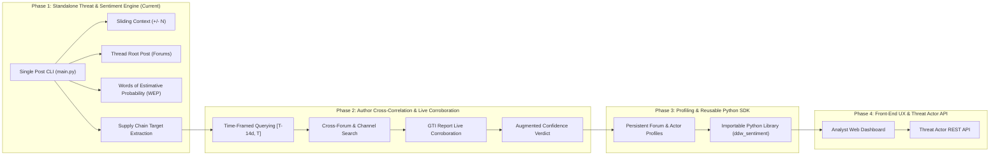

# 🕵️ Contextual Underground Threat & Sentiment Intelligence System (CUTSIS)

A cyber threat intelligence system that ingests dark web and Telegram chatter from the **Google Threat Intelligence (GTI)** DDW API, gathers a **sliding context window ($\pm N$ messages)** and **author cross-channel footprint**, and uses **Gemini 3.8 Flash LLM reasoning** to evaluate threat legitimacy, community peer validation, and supply chain exposure.

---

## 📌 Why Context Matters in Dark Web Chatter

Isolated keyword scrapers often trigger costly false alarms:
* A post claiming *"Selling administrative VPN access to Logistics Firm X"* may be an active intrusion, an unverified repost, or an outright scam.
* In underground communities, the true operational signal lies in the **immediate conversation surrounding the post**:
  - Peer vouches (`"vouch"`, `"verified by admin"`)
  - Negotiation progress (`"dm'ed"`, `"escrow?"`, `"+"`)
  - Scam accusations (`"fake proof"`, `"ripper / scammer"`)
* Short 1-word negotiation and vouch messages are **preserved without noise filtering** to capture transaction progression.

---

## 🗺️ 4-Phase Product Roadmap



* **[PRD.md](PRD.md):** Complete Product Requirements Document.
* **[IMPLEMENTATION_PLAN.md](IMPLEMENTATION_PLAN.md):** Detailed milestone plan across all phases.

---

## 🚀 Phase 1 Features

1. **Sliding Context Window ($\pm N$ messages):** Fast direct retrieval via GTI `/previous_communications` and `/next_communications`.
2. **Thread Root Grounding (Forums):** Automatically retrieves the opening post (post #1) for forum threads (`conversation_thread`) to contextualize replies against the original offering.
3. **Words of Estimative Probability (WEP):** Evaluates truth likelihood on intelligence doctrine standards (`Almost_Certain`, `Highly_Likely`, `Roughly_Even_Chance`, `Unlikely`, `Remote`, `Undetermined_Insufficient_Data`).
4. **Target & Supply Chain Extraction:** Identifies specific affected organizations, software stacks, and industrial sectors.
5. **Epistemic Scope Disclaimer:** Clearly notes that single-post assessments are derived strictly from observable post evidence without premature external assumptions.
6. **Bilingual Analytical Fidelity:** Retains both source language and English translations side-by-side.
7. **Adversarial Prompt Injection Defense:** Wraps all adversarial underground chatter in strict structural delimiters (`<<<UNTRUSTED_CONTENT>>>`).

---

## 📦 Installation & Setup

### 1. Requirements
Python 3.10+ is required.
```bash
pip install -r requirements.txt
```

### 2. Environment Variables
Set your API keys:
```bash
# Google Threat Intelligence / VirusTotal API Key
export GTI_APIKEY="your-gti-api-key"

# Gemini LLM API Key (used for CTI reasoning)
export GEMINI_API_KEY="your-gemini-api-key"
```

---

## 💻 CLI Usage

### 1. Contextual Post Evaluation
Evaluates a specific post within a $\pm 10$ message context window:
```bash
python main.py --id "185fa470-ec54-4ee4-97ae-ac5f5c4109b5" --window 10
```

### 2. Export to Structured JSON
```bash
python main.py --id "185fa470-ec54-4ee4-97ae-ac5f5c4109b5" --output analysis_record.json
```

### 3. Dry Run Preview (No LLM Call)
```bash
python main.py --id "185fa470-ec54-4ee4-97ae-ac5f5c4109b5" --dry-run
```

---

## 🛡️ Words of Estimative Probability (WEP) Matrix

| Level | Range | Evidence Criteria | Community Reaction |
| :--- | :---: | :--- | :--- |
| **Almost Certain** | **> 90%** | Verifiable data samples, working PoC, valid cryptographic signature; independently confirmed. | Confirmed escrow, verified staff guarantee, or multiple reputable vouchers. |
| **Highly Likely** | **70% – 89%** | Credible technical details (matching schema, specific endpoints/CVE, valid PGP) without third-party confirmation yet. | Positive peer reception, active negotiation in progress, 0 scam callouts. |
| **Roughly Even Chance** | **40% – 69%** | Plausible claim with minimal sample; standard relay forward; or uncorroborated market listing. | Neutral / ignored chatter, automated duplicate broadcast. |
| **Unlikely** | **20% – 39%** | Vague claims, refusal of samples, recycled text, upfront payment with no escrow. | Disputed by peers, scam accusations (`"ripper"`). |
| **Remote** | **< 20%** | Proven fabricated claims debunked by basic analysis, or confirmed banned scammer. | Direct call-out with proof of fraud, or user banned. |
| **Undetermined** | **N/A** | Open question/inquiry, casual discussion, or user complaints without threat assertions. | Non-assertive banter; no active compromise claim. |

---

## 🗄️ Sample CTI Output

```json
{
  "threat_and_supply_chain": {
    "intent_category": "Database_Breach_Leak",
    "estimative_probability": {
      "level": "Almost_Certain",
      "probability_range": "> 90%",
      "criteria_matched": [
        "Verifiable data samples provided AND independently confirmed by third party or official victim advisory"
      ],
      "rationale": "Breach claim of customer records from Target Vendor is corroborated by independent reporting and verified forum listing."
    },
    "is_actionable_threat": true,
    "explicitly_claimed_actor": null,
    "targeted_entities": ["Enterprise Vendor A", "Logistics Partner B", "Automotive Corp C"],
    "targeted_sectors": ["Identity Verification", "Logistics", "Automotive"],
    "targeted_technologies": ["Identity Verification Gateway"]
  },
  "community_sentiment_and_reaction": {
    "reaction_status": "Indifferent_Ignored",
    "buyer_interest_detected": false,
    "vouches_detected": false,
    "disputes_or_scam_warnings": false,
    "supporting_evidence_quotes": [],
    "reaction_narrative": "Broadcast via automated syndication feed without interactive chat replies."
  },
  "analytic_scope_disclaimer": "Assessment is based exclusively on the target post and immediate channel context window. External threat intelligence corroboration has not been performed.",
  "investigative_recommendation": "Cross-reference internal supplier exposure against affected third-party identity verification integrations."
}
```
